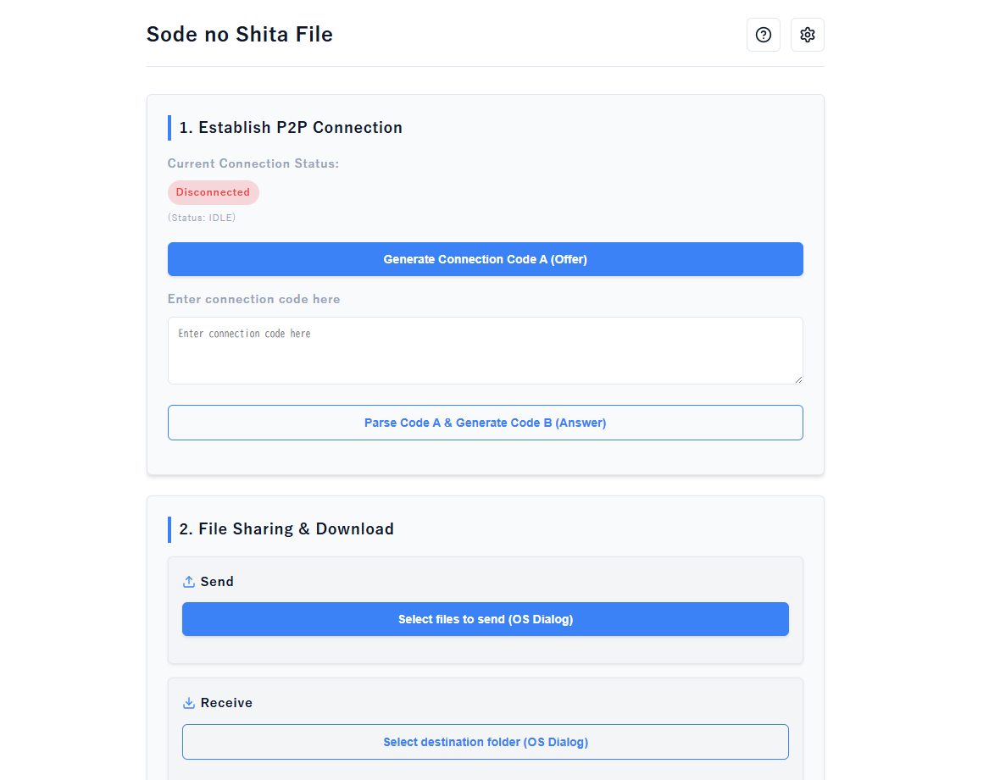

# 袖の下のファイル / Sode-no-Shita P2P



P2Pで直接ファイルやフォルダを双方向に送受信できる、軽量で安全なWebRTCファイル転送ツール / A lightweight and secure WebRTC file transfer tool that allows bidirectional P2P transfer of files and folders.

[](https://go.dev/)
[](https://www.typescriptlang.org/)
[](https://reactjs.org/)
[](https://vitejs.dev/)
[](https://webrtc.org/)
[](LICENSE)

[日本語](#日本語) | [English](#english)

## 日本語

### 特徴
* **サーバーレスP2P通信**: WebRTCを利用し、デバイス間で直接ファイルを転送します。ファイルデータが外部サーバーを経由することはありません。
* **インストール不要**: 単一の実行ファイルとして提供されるため、ダウンロードしてすぐに使用できます。
* **マルチプラットフォーム対応**: Windows、macOS、Linuxで動作します。
* **直感的なOSダイアログ**: ネイティブのファイル選択ダイアログを使用し、簡単にファイルや保存先フォルダを指定できます。

### インストール方法

#### 一般ユーザー向け（推奨）
[Releases](https://github.com/DovahkiinYuzuko/Sode-no-Shita/releases) ページから、お使いのOSに合った最新の実行ファイルをダウンロードしてください。

#### 開発者向け（ソースからのビルド）

> [!NOTE]
> ビルドには、**Go** と **Node.js** がシステムにインストールされている必要があります。

**Windowsの場合 (PowerShell)**
```powershell
git clone https://github.com/DovahkiinYuzuko/Sode-no-Shita.git
cd Sode-no-Shita

# フロントエンドのビルド
cd frontend
npm install
npm run build
cd ..

# バックエンドのビルド
go build -o sode-no-shita.exe main.go
```

**macOS / Linux の場合 (Bash / Zsh)**
```bash
git clone https://github.com/DovahkiinYuzuko/Sode-no-Shita.git
cd Sode-no-Shita

# フロントエンドのビルド
cd frontend
npm install
npm run build
cd ..

# バックエンドのビルド
go build -o sode-no-shita main.go
```

### 使い方
ファイル転送は以下の3ステップで完了します。

> [!WARNING]
> OfferコードとAnswerコードには、P2P接続を確立するための情報が含まれています。信頼できる相手にのみ共有してください。

1. **Offerの作成（一方のユーザー）**: アプリを起動し、「Offer作成」ボタンを押します。生成されたコードをもう一方のユーザーに共有します。
2. **Answerの作成（もう一方のユーザー）**: アプリを起動し、もらったOfferコードを入力して「Answer作成」ボタンを押します。生成されたコードを返します。
3. **接続の確立（最初のユーザー）**: 返してもらったAnswerコードを入力して「接続」ボタンを押します。

接続が確立されると、双方向にファイルを選択して送受信できるようになります。

### LICENSE
このプロジェクトのライセンスはMITです。詳しくは[LICENSE.MIT](LICENSE.MIT)をお読みください。また、サードパーティライセンスは[NOTICE.md](NOTICE.md)に表記してあります。

---

## English

### Features
* **Serverless P2P Communication**: Uses WebRTC to transfer files directly between devices. Your file data never passes through an external server.
* **No Installation Required**: Provided as a single executable file, ready to use immediately after downloading.
* **Cross-Platform**: Works on Windows, macOS, and Linux.
* **Native OS Dialogs**: Uses intuitive native file picker dialogs to easily select files and destination folders.

### Installation

#### General Users (Recommended)
Download the latest executable for your OS from the [Releases](https://github.com/DovahkiinYuzuko/Sode-no-Shita/releases) page.

#### Developers (Build from source)

> [!NOTE]
> Building from source requires **Go** and **Node.js** to be installed on your system.

**For Windows (PowerShell)**
```powershell
git clone https://github.com/DovahkiinYuzuko/Sode-no-Shita.git
cd Sode-no-Shita

# Build frontend
cd frontend
npm install
npm run build
cd ..

# Build backend
go build -o sode-no-shita.exe main.go
```

**For macOS / Linux (Bash / Zsh)**
```bash
git clone https://github.com/DovahkiinYuzuko/Sode-no-Shita.git
cd Sode-no-Shita

# Build frontend
cd frontend
npm install
npm run build
cd ..

# Build backend
go build -o sode-no-shita main.go
```

### How to Use
File transfer is completed in 3 simple steps:

> [!WARNING]
> Offer and Answer codes contain information required to establish a P2P connection. Only share them with trusted parties.

1. **Create Offer (User A)**: Launch the app and click the "Create Offer" button. Share the generated code with User B.
2. **Create Answer (User B)**: Launch the app, enter the Offer code received from User A, and click the "Create Answer" button. Return the generated code to User A.
3. **Establish Connection (User A)**: Enter the Answer code received from User B and click the "Connect" button.

Once connected, both parties can select and transfer files bidirectionally.

### LICENSE
This project is licensed under the MIT License. Please read [LICENSE.MIT](LICENSE.MIT) for details. Additionally, third-party licenses are listed in [NOTICE.md](NOTICE.md).
