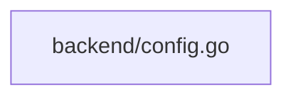

## 依存関係 (Dependencies)

## 各定義 of `backend/config.go`

### `AppConfig` (L10-10)
* **Description:** アプリケーションの設定（テーマ、言語、および中継用TURNサーバー情報）を保持する構造体。
* **Fields:**
  * `Theme` (`string`): カラーテーマ（"dark" | "light"）
  * `Lang` (`string`): 表示言語（"ja" | "en"）
  * `TurnServerURL` (`string`): 中継TURNサーバーのURL（例: `turn:turn.example.com:3478`）
  * `TurnUsername` (`string`): TURNサーバー認証のユーザー名
  * `TurnCredential` (`string`): TURNサーバー認証のパスワード・クレデンシャル

### (Function) `LoadConfig` (L21-53)
* **Description:** カレントディレクトリから設定ファイル `sode-no-shita-config.json` を読み込む。存在しない場合は、デフォルト設定（ダークモード、日本語）でファイルを生成して返す。
* **Returns:**
  * `AppConfig`: 読み込まれた（または生成された）設定情報

### (Function) `SaveConfig` (L56-69)
* **Description:** 指定された設定情報を `sode-no-shita-config.json` にJSONフォーマットで永続化保存する。
* **Arguments:**
  * `cfg` (`AppConfig`): 保存する設定オブジェクト
* **Returns:**
  * `error`: 書き込みに失敗した際のエラー