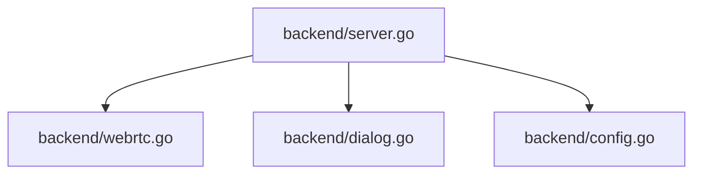

## 依存関係 (Dependencies)

## 各定義 of `backend/server.go`

### (Function) `StartWebServer` (L62-421)
* **Description:** HTTP APIハンドラを登録し、埋め込みWebサーバーを起動する。
* **Arguments:**
  * `port` (int): 起動するポート番号
* **Details:**
  * 起動時に `LoadConfig()` を呼び出して、設定を `GlobalState.Config` に読み込む。
  * FSM制御のための `/api/webrtc/reset`（状態リセット）および、設定永続化のための `/api/config/update`（テーマ/言語設定およびTURN中継サーバー設定の更新とファイル保存）のエンドポイントをハンドリングする。
  * 転送完了モーダルの状態リセット用の `/api/webrtc/clear-completed` (POST) エンドポイントを定義し、呼び出された際に `GlobalState.CompletedFile` を空にする。
  * `/api/status`（SSE）接続状況を監視し、クライアント接続数が 0 になると自動的に5秒のシャットダウンカウントダウンを開始する。
  * `/api/dialog/file` APIにて、データチャネルが接続済み（`dataChannel != nil`）の状態で新規ファイルが選択された場合、即座に対向にファイルリストを送信（`sendInfoList`）して同期させる。

### (Variable) `activeSSEClients` (L22-22)
* **Description:** 現在アクティブな SSE 接続数を保持するカウンタ。

### (Function) `checkShutdown` (L26-49)
* **Description:** クライアント接続数が 0 になった際に、5秒の遅延シャットダウンタイマーを起動する。

### (Function) `cancelShutdown` (L51-60)
* **Description:** 新しい SSE クライアントが接続した際、予約されたシャットダウンタイマーを停止する。