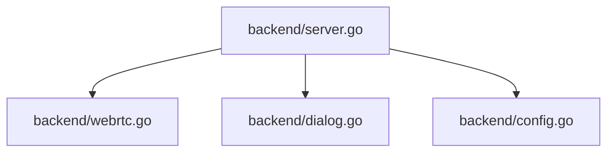

## 依存関係 (Dependencies)

## 各定義 of `backend/server.go`

### (Function) `StartWebServer` (L19-337)
* **Description:** HTTP APIハンドラを登録し、埋め込みWebサーバーを起動する。
* **Arguments:**
  * `port` (int): 起動するポート番号
* **Details:**
  * 起動時に `LoadConfig()` を呼び出して、設定を `GlobalState.Config` に読み込む。
  * FSM制御のための `/api/webrtc/reset`（状態リセット）および、設定永続化のための `/api/config/update`（テーマ/言語設定の更新とファイル保存）のエンドポイントを新設してハンドリングする。