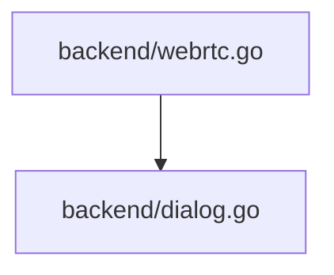

## 依存関係 (Dependencies)

## 各定義の仕様

### `GlobalState` (L48-52)
* **Description:** アプリケーション全体の転送ステータスや選択ファイルを保持するグローバル共有構造体。

### (Initialization) `init` (L60-81)
* **Description:** WebRTCのAPIおよび `SettingEngine` を初期化する。
* **Details:**
  * `SettingEngine.SetInterfaceFilter` を使用し、接続性のない仮想ネットワークインターフェース（`vethernet`, `docker`, `virtual`, `wsl`, `vmware` を含む名称のもの）をICE収集対象から除外する。

### (Function) `InitWebRTCPeer` (L83-166)
* **Description:** WebRTCピア接続（pion/webrtc）を初期化し、接続コードを生成する。あるいは対向の接続コードを解析して接続する。
* **Arguments:**
  * `isOffer` (bool): 接続を待つ側（オファー側）かどうか
* **Returns:**
  * `string`: 接続コード（圧縮SDP）
  * `error`: 初期化エラー
* **Details:**
  * `isOffer` が `true` の場合、オファーを生成し、`webrtc.GatheringCompletePromise` でICE収集完了を待つ。
  * ただし、オフライン環境などでのフリーズを防ぐため、`time.After(3 * time.Second)` を用いて最大3秒のタイムアウトを設ける。
  * タイムアウトが発生した場合でもエラーとはせず、その時点で収集できているローカルのホストCandidateのみを含んだSDPで処理を続行し、フロントエンドに接続コードAを返す。

### (Function) `ConnectAnswer` (L168-180)
* **Description:** オファー側のピア接続に、接続コードB（アンサーSDP）をデコードして適用し、接続を開始する。
* **Arguments:**
  * `answerCode` (string): 接続コードB

### (Function) `AcceptOfferAndCreateAnswer` (L182-220)
* **Description:** 接続側（受信側）のピア接続に、接続コードA（オファーSDP）をデコードして適用し、接続コードB（アンサーSDP）を生成・圧縮して返す。
* **Arguments:**
  * `offerCode` (string): 接続コードA
* **Returns:**
  * `string`: 接続コードB（圧縮SDP）
  * `error`: エラー
* **Details:**
  * アンサーを生成し、`webrtc.GatheringCompletePromise` でICE収集完了を最大3秒間待つ。
  * タイムアウトが発生した場合でもエラーとはせず、その時点で収集できているホストCandidateのみを含むSDPで処理を続行し、フロントエンドに接続コードBを返す。

### (Function) `handleFileSendRequest` (L421-485)
* **Description:** 指定された単一ファイルをData Channel経由でチャンク分割して送信する。
* **Arguments:**
  * `fileName` (string): 送信ファイル名

### (Function) `handleZipSendRequest` (L487-570)
* **Description:** 選択された複数ファイルをメモリ上で動的（オンザフライ）にZIP化しながら、Data ChannelへZIPストリームとして送信する。
* **Arguments:**
  * `fileName` (string): 作成する仮想的なZIPファイル名（通常は全ファイルをまとめるZIP）