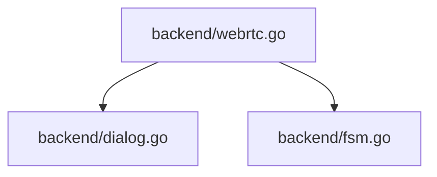

## 依存関係 (Dependencies)

## 各定義 of `backend/webrtc.go`

### `GlobalState` (L50-55)
* **Description:** アプリケーション全体の転送ステータスや選択ファイルを保持するグローバル共有構造体。
* **Details:**
  * 新たに `FSMState` フィールドが定義され、接続のFSM状態（`IDLE`, `GENERATING_OFFER` など）が管理される。

### (Initialization) `init` (L63-84)
* **Description:** WebRTCのAPIおよび `SettingEngine` を初期化する。
* **Details:**
  * `SettingEngine.SetInterfaceFilter` を使用し、接続性のない仮想ネットワークインターフェース（`vethernet`, `docker`, `virtual`, `wsl`, `vmware` を含む名称のもの）をICE収集対象から除外する。

### (Function) `InitWebRTCPeer` (L86-188)
* **Description:** WebRTCピア接続（pion/webrtc）を初期化し、接続コードを生成する。あるいは対向の接続コードを解析して接続する。
* **Arguments:**
  * `isOffer` (bool): 接続を待つ側（オファー側）かどうか
* **Returns:**
  * `string`: 接続コード（圧縮SDP）
  * `error`: 初期化エラー
* **Details:**
  * `isOffer` が `true` の場合（待機側）、`TransitionTo(StateGeneratingOffer)` を実行して状態を `GENERATING_OFFER` に移行し、オファーSDPを作成しICEの収集（最大3秒タイムアウト）を待つ。
  * 収集完了またはタイムアウト後、`TransitionTo(StateWaitingForAnswer)` を実行して状態を `WAITING_FOR_ANSWER` に移行し、コードを圧縮して返す。
  * `isOffer` が `false` の場合（接続側）、`TransitionTo(StateGeneratingAnswer)` を実行して状態を `GENERATING_ANSWER` に移行する。

### (Function) `ConnectAnswer` (L190-207)
* **Description:** オファー側のピア接続に、接続コードB（アンサーSDP）をデコードして適用し、接続を開始する。
* **Arguments:**
  * `answerCode` (string): 接続コードB
* **Details:**
  * 実行開始時に `TransitionTo(StateConnecting)` を実行して `CONNECTING` 状態に移行する。

### (Function) `AcceptOfferAndCreateAnswer` (L209-249)
* **Description:** 接続側（受信側）のピア接続に、接続コードA（オファーSDP）をデコードして適用し、接続コードB（アンサーSDP）を生成・圧縮して返す。
* **Arguments:**
  * `offerCode` (string): 接続コードA
* **Returns:**
  * `string`: 接続コードB（圧縮SDP）
  * `error`: エラー
* **Details:**
  * アンサーを生成し、`webrtc.GatheringCompletePromise` でICE収集完了を最大3秒間待つ。
  * 収集完了またはタイムアウト後、`TransitionTo(StateConnecting)` を実行して状態を `CONNECTING` に移行し、接続コードBを返す。

### (Function) `handleFileSendRequest` (L450-514)
* **Description:** 指定された単一ファイルをData Channel経由でチャンク分割して送信する。
* **Arguments:**
  * `fileName` (string): 送信ファイル名

### (Function) `handleZipSendRequest` (L516-599)
* **Description:** 選択された複数ファイルをメモリ上で動的（オンザフライ）にZIP化しながら、Data ChannelへZIPストリームとして送信する。
* **Arguments:**
  * `fileName` (string): 作成する仮想的なZIPファイル名（通常は全ファイルをまとめるZIP）