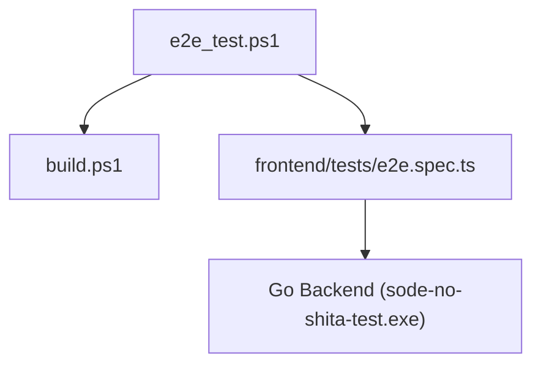

## 概要

このスクリプトは、Goバックエンドサーバーを送信側（ポート8080）と受信側（ポート8081）の2つ起動し、フロントエンドのPlaywright E2Eテストを実行して、自動接続とファイル転送フローの正常性を検証します。テスト完了後、成否に関わらず自動的にサーバープロセスを強制終了しクリーンアップします。

## 依存関係マッピング

## 変数定義

### `$RootPath`
スクリプト実行時のルートディレクトリの絶対パス。

### `$DummyFilePath`
送信テストに用いるテスト用ダミーファイル（`dummy/text.txt`）の絶対パス。

### `$RecvDirPath`
受信テストに用いるダミー受信フォルダ（`dummy/recv`）の絶対パス。

### `$SenderProc`
起動した送信側Goサーバー（ポート8080）のプロセス情報。

### `$ReceiverProc`
起動した受信側Goサーバー（ポート8081）のプロセス情報。

### `$Success`
Playwrightテストが成功したかどうかを保持する真偽値フラグ。
