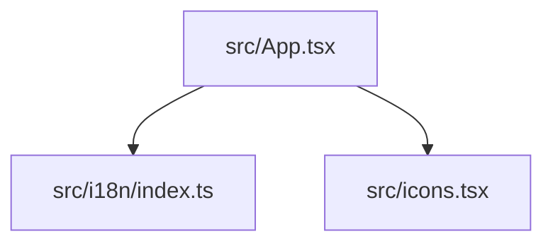

## 依存関係 (Dependencies)

## 各定義 of `frontend/src/App.tsx`

### `App`
* **Description:** メインUIコンポーネント。GoのAPIを呼び出し、SSE `/api/status` からFSMの接続状態を購読して画面上にリアルタイム描画する。
* **Details:**
  * 状態の描画制御は、従来の `connState` に代わり、FSMの状態を表す `fsmState` フィールドを基に行われる。
  * `fsmState` が `WAITING_FOR_ANSWER` のとき、生成されたOfferコード（A）およびAnswer入力エリアを表示する。
  * `fsmState` が `FAILED` のとき、エラー状態と「リセット」ボタンを表示し、初期状態 `IDLE` に戻れるようにする。

### (Function) `BudouText`
* **Description:** 日本語（`lang === 'ja'`）表示の際に、Googleの `budoux` ライブラリを使用して美しい改行位置調整を行うコンポーネント。
* **Arguments:**
  * `text` (string): 折り返しを適用するプレーンテキスト。
  * `enabled` (boolean): 折り返しを有効にするかどうかのフラグ（日本語のみ `true`）。
