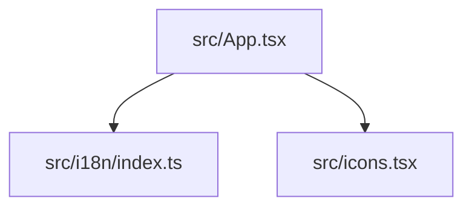

## 依存関係 (Dependencies)

## 各定義 of `frontend/src/App.tsx`

### `App`
* **Description:** メインUIコンポーネント。GoのAPIを呼び出し、SSE `/api/status` からFSMの接続状態を購読して画面上にリアルタイム描画する。
* **Details:**
  * 状態の描画制御は、従来の `connState` に代わり、FSMの状態を表す `fsmState` フィールドを基に行われる。
  * `fsmState` が `WAITING_FOR_ANSWER` のとき、生成されたOfferコード（A）およびAnswer入力エリアを表示する。
  * `fsmState` が `FAILED` のとき、エラー状態と「リセット」ボタンを表示し、初期状態 `IDLE` に戻れるようにする。

### (Function) `BudouText`
* **Description:** 日本語（`lang === 'ja'`）表示の際に、Googleの `budoux` ライブラリを使用して美しい改行位置調整を行うコンポーネント。
* **Arguments:**
  * `text` (string): 折り返しを適用するプレーンテキスト。
  * `enabled` (boolean): 折り返しを有効にするかどうかのフラグ（日本語のみ `true`）。

### (Function) `toBudouString`
* **Description:** Googleの `budoux` を使用して、プレーンテキストの折り返し可能位置にゼロ幅スペース（`\u200B`）を挿入した文字列を生成するヘルパー関数。`<textarea>` の `placeholder` など、HTMLタグが使えないプレーンテキスト属性の改行位置調整に用いる。
* **Arguments:**
  * `text` (string): 変換元のテキスト。
  * `enabled` (boolean): 変換を有効にするかどうかのフラグ。
* **Returns:**
  * `string`: ゼロ幅スペースで結合されたテキスト、または元のテキスト。

### `App`
* **Description:** メインUIコンポーネント。GoのAPIを呼び出し、SSE `/api/status` からFSMの接続状態を購読して画面上にリアルタイム描画する。
* **Details:**
  * 状態の描画制御は、従来の `connState` に代わり、FSMの状態を表す `fsmState` フィールドを基に行われる。
  * `fsmState` が `WAITING_FOR_ANSWER` のとき、生成されたOfferコード（A）およびAnswer入力エリアを表示する。
  * `fsmState` が `FAILED` のとき、エラー状態と「リセット」ボタンを表示し、初期状態 `IDLE` に戻れるようにする。
  * 送受信（ダウンロード・アップロード）完了を検知した際、完了したファイル名とロールを保持する `transferComplete` 状態を設定し、UI上で「送受信完了モーダル」を表示する。完了検知は、SSE経由で `completedFile` が流れてきたことを基に行う。ユーザーがモーダルを閉じたタイミングで `/api/webrtc/clear-completed` に対して POST リクエストを送り、Go側の完了状態をリセットする。これにより、同名ファイルの連続受信やSSEポーリングのレースコンディションでも正しくモーダルが閉じて再開できる。
