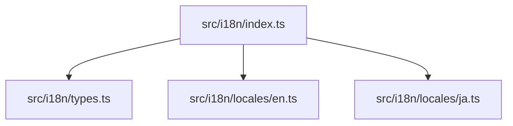

## 依存関係 (Dependencies)

## 各定義 of `src/i18n/index.ts`

### `locales`
* **Description:** アプリケーション内で利用可能な言語辞書のマップ。Viteの `import.meta.glob` を用いて、`locales/` フォルダ配下の全言語ファイルを自動でクロールして構築される。

### `defaultLang`
* **Description:** アプリケーションのデフォルト言語。値は `"en"`。
